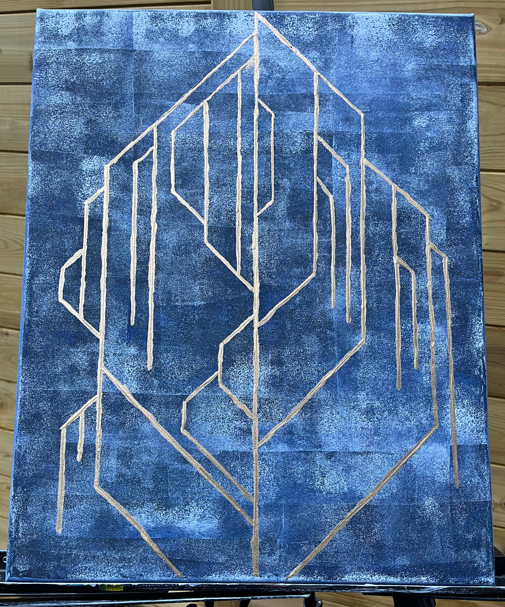
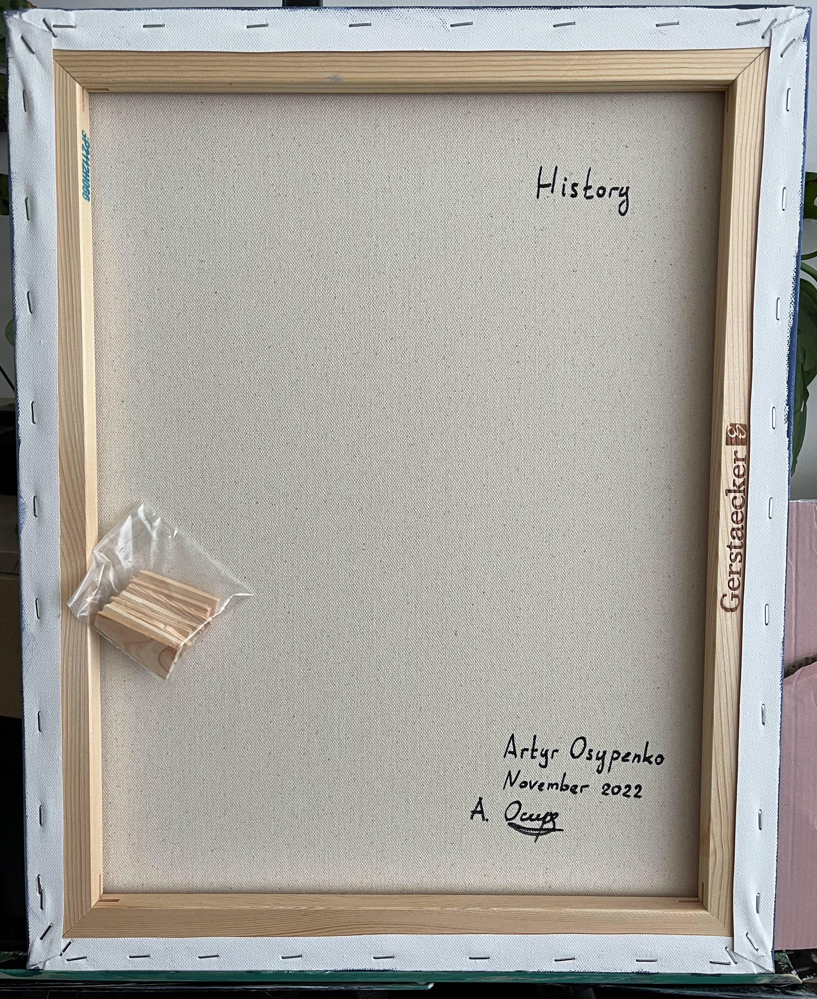

# History 

## Description

History is a tree with people's decisions as branches. Unlike the natural tree, some branches merge back to their origin. 
Such contribution will continue to live. Some branches lead to a void.

## Materials

### Canvas

Streatched canvas Gerstaecker Studio 2

cotton, universal primer, low absorbency

Size: 40 × 50 cm / 16 × 20 inches

Number: SP2112H066

### Paint 

Winsor & Newton Galeria acrylic

Schmincke acryl bronze pale gold

### Signature

Liquitex professional acrylic marker 

carbon black (PBk7)

## Author

Artur Osypenko

October 2022

| FRONT | BACK |
| --- | --- |
|   |   |
