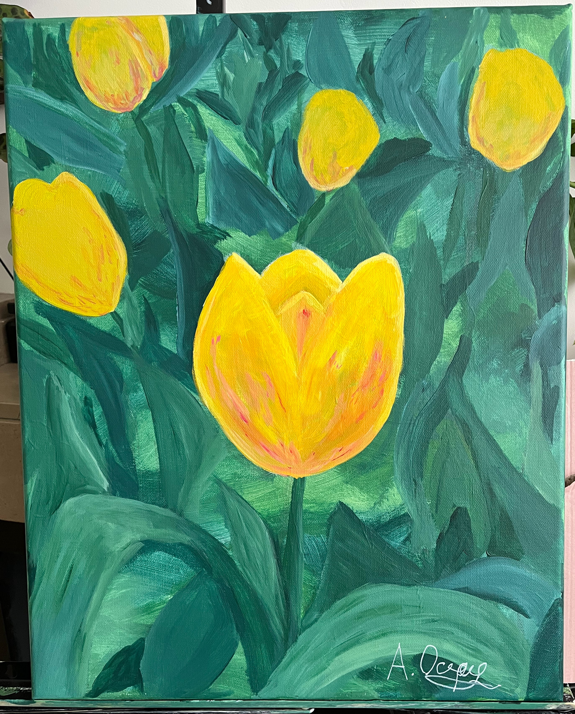
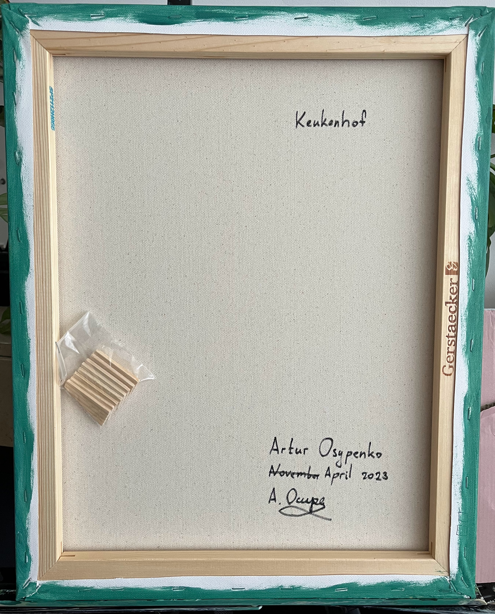

# Keukenhof 

## Description

Tulipa "Paint Brush"

## Materials

### Canvas

Streatched canvas Gerstaecker Studio 2

cotton, universal primer, low absorbency

Size: 40 × 50 cm / 16 × 20 inches

Number: SP2112H066

### Paint 

Winsor & Newton Galeria acrylic

### Signature

Liquitex professional acrylic marker 

carbon black (PBk7)

## Author

Artur Osypenko

April 2022

| FRONT | BACK |
| --- | --- |
|   |   |
